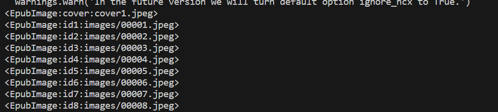

# Noveled
A python app for reading.

## prerequisite
```powershell
pip install PyQt5
pip install EbookLib
```
## File format supported
- pdf
- epub

### Check List
- [ ] add background and font color control
- [ ] read from sites using url
- [ ] control navigation using arrow keys

### chatGPT link
- https://chat.openai.com/share/68defc3c-ca48-4bd9-9171-4d4623a1db84

### cover page
```python
cover_image = book.get_item_with_id('cover1.jpg')
```
### image containing name of ..... images?


